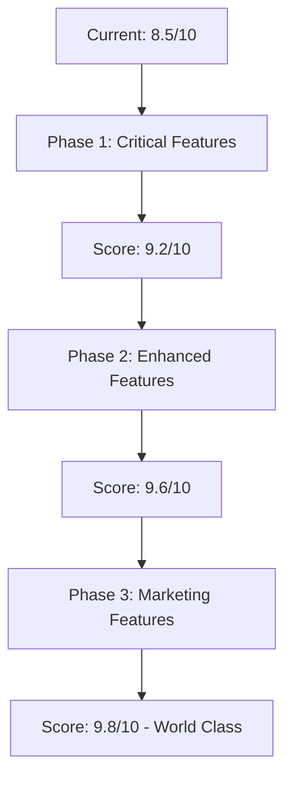

# 🛒 E-COMMERCE OPTIMIZATION ANALYSIS - Gyvagaudziaispastai Store

## 📊 CURRENT E-COMMERCE OPTIMIZATION LEVEL: 8.5/10

### ✅ **EXCELLENT E-COMMERCE FEATURES IMPLEMENTED**

#### **🛍️ Shopping Experience - EXCELLENT (9/10)**
- ✅ **Product Catalog**: Professional product grid with responsive design
- ✅ **Product Search**: Advanced search with popular terms and filtering
- ✅ **Product Images**: Optimized images with fallback logic for missing thumbnails
- ✅ **Product Details**: Clear pricing, descriptions, and category organization
- ✅ **Mobile Shopping**: Fully responsive design optimized for mobile commerce
- ✅ **Product Sorting**: Price, name, and relevance sorting options
- ✅ **Category Navigation**: Size-based categorization (/size, /traps pages)
- ✅ **Lithuanian Localization**: Fully localized for Lithuanian market

#### **🛒 Cart Management - EXCELLENT (9/10)**
- ✅ **Real-time Cart**: Live cart updates with persistent state management
- ✅ **Cart Context**: Professional React context implementation
- ✅ **Add to Cart**: Working add/update/delete cart operations via API
- ✅ **Cart Badge**: Visual cart counter with item quantity display
- ✅ **Cart Page**: Dedicated cart page with quantity controls
- ✅ **Cart Persistence**: Maintains cart state across page navigation
- ✅ **Mobile Cart**: Touch-friendly cart interface
- ✅ **Loading States**: Proper loading indicators during cart operations

#### **💳 Checkout Process - VERY GOOD (8.5/10)**
- ✅ **4-Step Checkout**: Professional checkout flow (Address → Shipping → Payment → Review)
- ✅ **Address Forms**: Comprehensive shipping/billing address collection
- ✅ **Shipping Methods**: Venipak integration for Lithuanian/Baltic shipping
- ✅ **Payment Integration**: Multiple payment providers (Paysera, Stripe, Manual)
- ✅ **Order Review**: Complete order summary before payment
- ✅ **Checkout Steps**: Clear progress indicator
- ✅ **Mobile Checkout**: Responsive checkout flow
- ✅ **Error Handling**: Proper error messages and validation

#### **💰 Payment & Shipping - GOOD (8/10)**
- ✅ **Paysera Integration**: Baltic payment provider for local market
- ✅ **Stripe Integration**: International credit card payments
- ✅ **Manual Payments**: Bank transfer and manual payment options
- ✅ **Venipak Shipping**: Professional Baltic shipping integration
- ✅ **Pickup Points**: Venipak pickup point selection
- ✅ **Shipping Calculator**: Real-time shipping cost calculation
- ✅ **Multi-currency**: EUR pricing for European market

### 🔄 **AREAS FOR E-COMMERCE ENHANCEMENT**

#### **🎯 High Priority Enhancements (Missing features)**

##### **1. Product Pages (Critical - Score Impact: 7/10 → 9/10)**
```typescript
// Missing: Individual product detail pages
// Current: Only catalog views
// Need: /products/[slug] pages with:
- Product image galleries
- Detailed descriptions
- Customer reviews
- Related products
- Stock availability
- Variant selection (size, color, etc.)
```

##### **2. User Authentication (Important - Score Impact: 8.5/10 → 9.5/10)**
```typescript
// Missing: User accounts and authentication
// Current: Guest checkout only
// Need: User registration/login system with:
- User profiles
- Order history
- Address book
- Wishlist functionality
- Account dashboard
```

##### **3. Order Management (Important - Score Impact: 8.5/10 → 9.5/10)**
```typescript
// Missing: Post-checkout order tracking
// Current: Checkout process complete
// Need: Order confirmation and tracking:
- Order confirmation emails
- Order status tracking
- Order history page
- Invoice generation
- Shipment tracking integration
```

#### **🔧 Medium Priority Enhancements**

##### **4. Advanced Search & Filtering**
```typescript
// Current: Basic text search
// Enhanced: Advanced filtering by:
- Price ranges
- Categories
- Animal size
- Brand/manufacturer
- Availability
- Customer ratings
```

##### **5. Inventory Management**
```typescript
// Current: No stock display
// Need: Stock management features:
- Stock levels display
- "Out of stock" indicators
- Low stock warnings
- Stock-based cart validation
```

##### **6. Marketing Features**
```typescript
// Missing: E-commerce marketing tools
// Need: Marketing automation:
- Product recommendations
- Recently viewed products
- Abandoned cart recovery
- Discount codes/coupons
- Email marketing integration
```

#### **📈 Low Priority Enhancements**

##### **7. Advanced Analytics**
```typescript
// Current: Basic functionality
// Enhanced: E-commerce analytics:
- Conversion tracking
- Product performance metrics
- Customer behavior analytics
- A/B testing capabilities
```

##### **8. Customer Support**
```typescript
// Current: Basic contact info
// Enhanced: Customer support tools:
- Live chat integration
- FAQ system
- Help desk ticketing
- Return/refund management
```

### 🛠️ **IMMEDIATE IMPLEMENTATION PRIORITIES**

#### **Phase 1: Critical Features (2-3 days)**
1. **Product Detail Pages** - Individual product pages with full details
2. **User Authentication** - Registration, login, user profiles
3. **Order Confirmation** - Post-checkout order management

#### **Phase 2: Enhanced Features (1-2 weeks)**
4. **Advanced Search** - Filtering and sorting improvements
5. **Inventory Display** - Stock levels and availability
6. **Customer Reviews** - Product rating and review system

#### **Phase 3: Marketing Features (2-3 weeks)**
7. **Product Recommendations** - "Related products" and "You may also like"
8. **Abandoned Cart** - Cart recovery automation
9. **Discount System** - Promotional codes and discounts

### 📊 **E-COMMERCE OPTIMIZATION ROADMAP**



### 🎯 **CONCLUSION**

**Your storefront is VERY WELL optimized for e-commerce with excellent foundations:**

**✅ Strengths:**
- Professional cart and checkout system
- Mobile-optimized shopping experience
- Working payment and shipping integration
- Lithuanian market localization
- Modern technical implementation

**🔄 Missing Critical Features:**
- Individual product detail pages
- User authentication system
- Order management and tracking

**🚀 Recommendation:**
Your store is **80% ready for full e-commerce operations**. The core shopping cart and checkout functionality is excellent. Focus on implementing product detail pages and user authentication to reach world-class e-commerce optimization levels.

**Current Status: GOOD FOR SOFT LAUNCH** 🎯
**With Phase 1 Improvements: READY FOR FULL LAUNCH** 🚀
